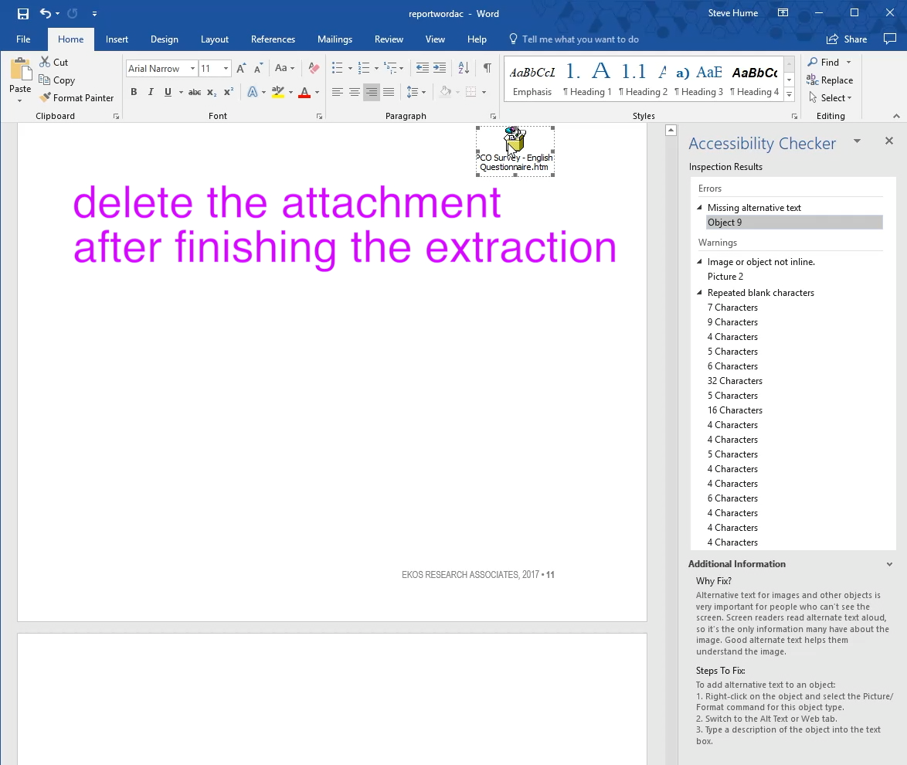
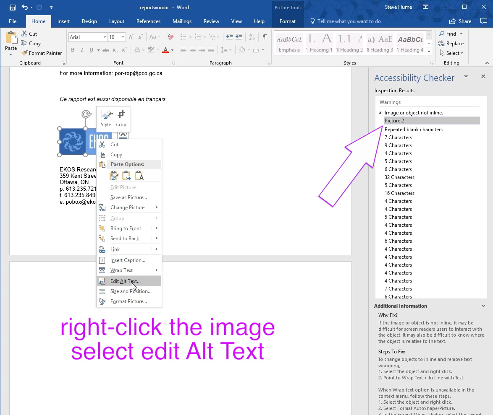
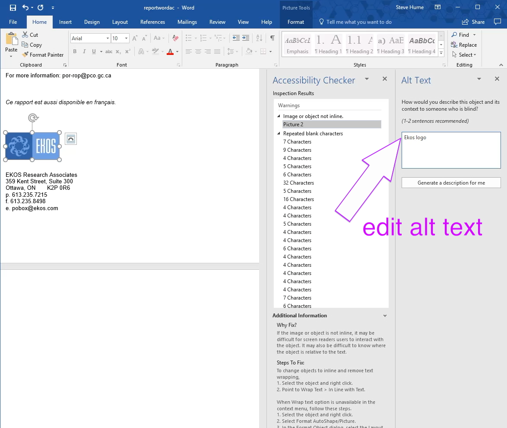
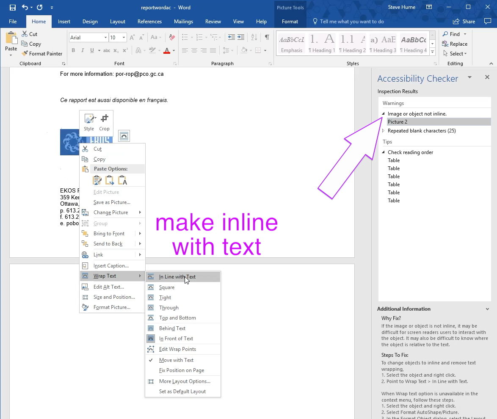
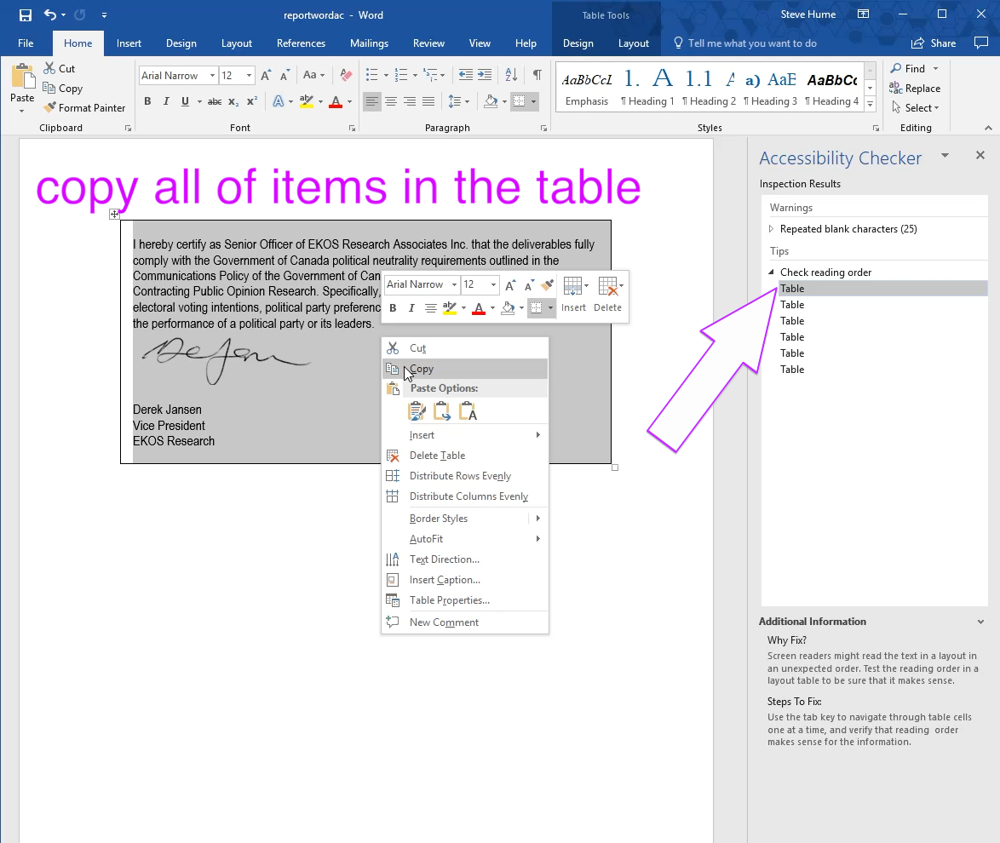
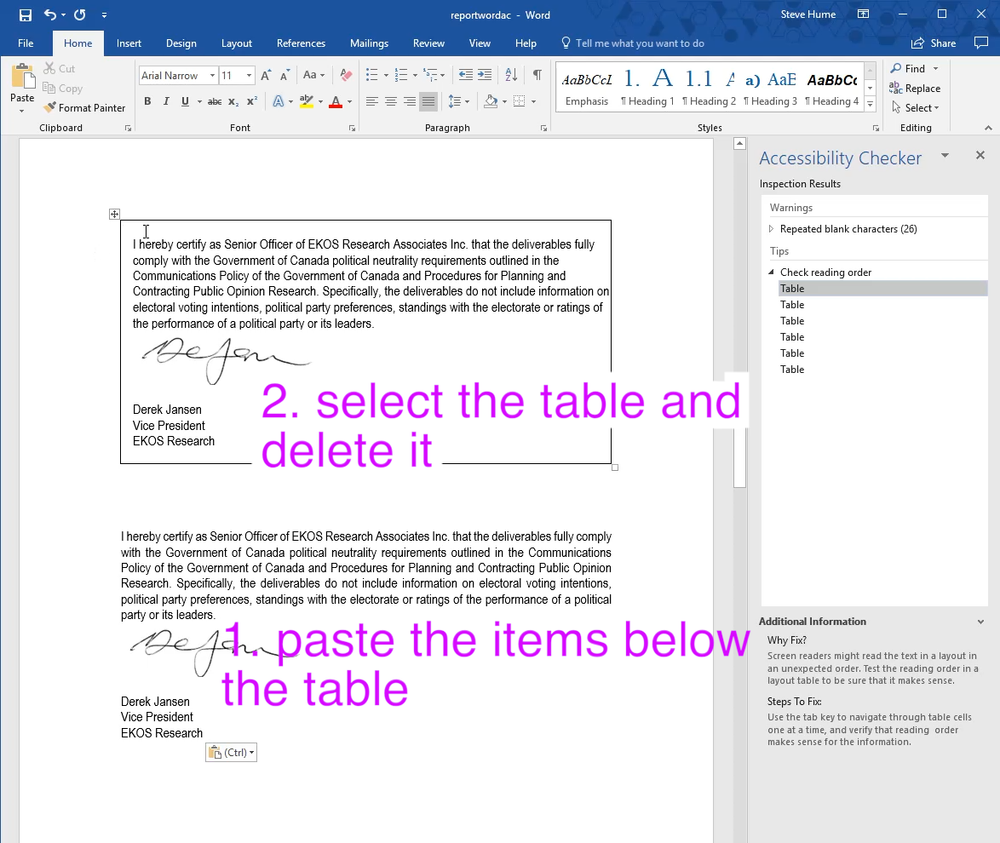

# Alt Text review and removing text from tables and shapes

The goal is to bring all the text to the top flow in the word document. It is often inside a table and or a shape to help with page layout but this interferes with the conversion tools because they cannot deduce the order of the text that is required for HTML flow order.

Here are some typical operations from the sample project file:

- delete the Object that contains the html we have extracted previously

- use the accessibility checker to move to the next picture and repair the Alt Text.

- the image is also needing to be placed inline with the text flow as recommended by the checker

- moving on to the next checker item we find some item inside a table for formatting reasons only.  First copy all the contents.

- paste the text after the table and then delete the table

It is a good idea to save the file now as it is easier to revert to a saved copy if you accidentally do some incorrect delete.