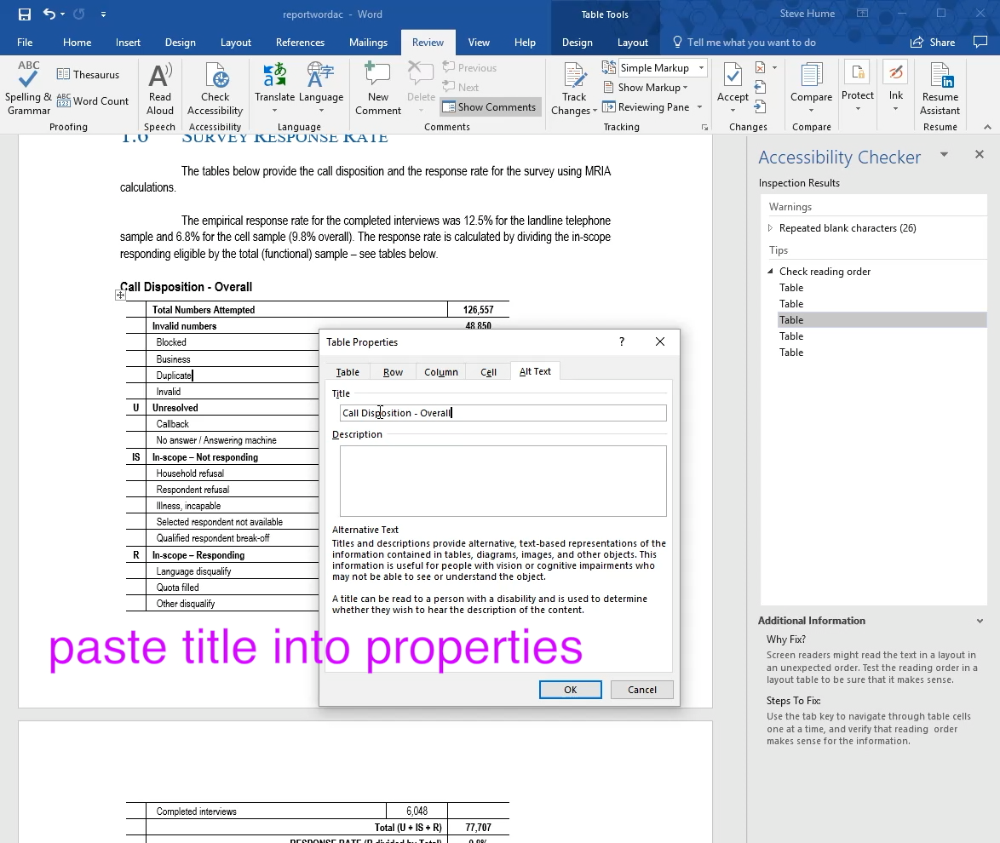

# Improve table accessibility by adding titles to the table properties

The WCAG recommendations for tables prefer a title or description associated the table to help the screenreader to describe the table contents.  You could at very elaborate description to help as the tables are often too complex.

Here are some typical operations from the sample project file:

- a title preceeds the table. Make a copy of it.

- right click the table and select table properties

- edit the title and description with as much help as you think is needed for accessibility.

This is repeated for all the tables.

It is a good idea to save the file now as it is easier to revert to a saved copy if you accidentally do some incorrect delete.