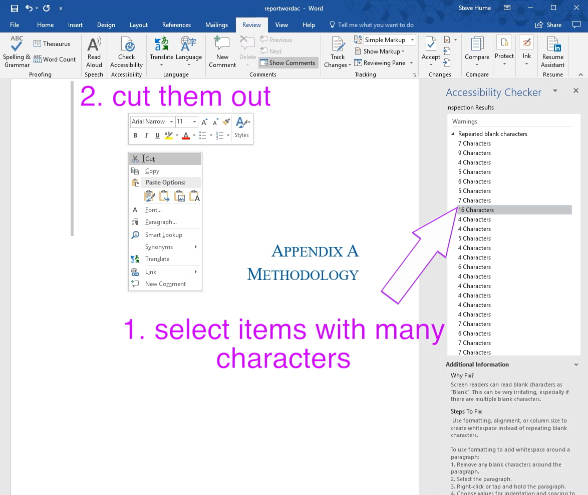

# Repeated blank character warnings

The Word accessibility checker recommends removing extra space.  This is probably useful if the Word document itself becomes accessible in the future.

I found that the conversion process that I use through Markdown format tends to remove any damaging effects of this whitespace.

Here are some typical operations from the sample project file:

- I chose to just address the larger sets of spaces. 

