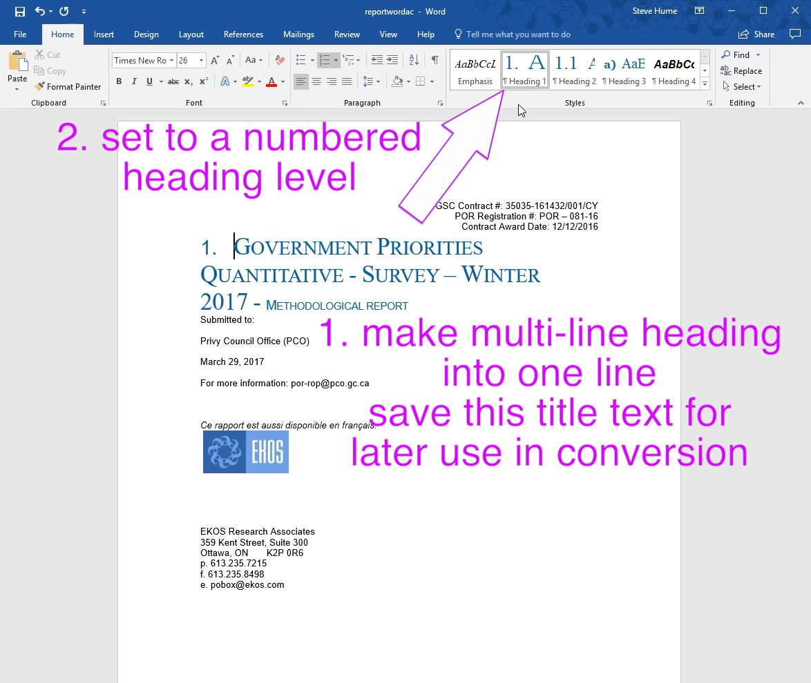
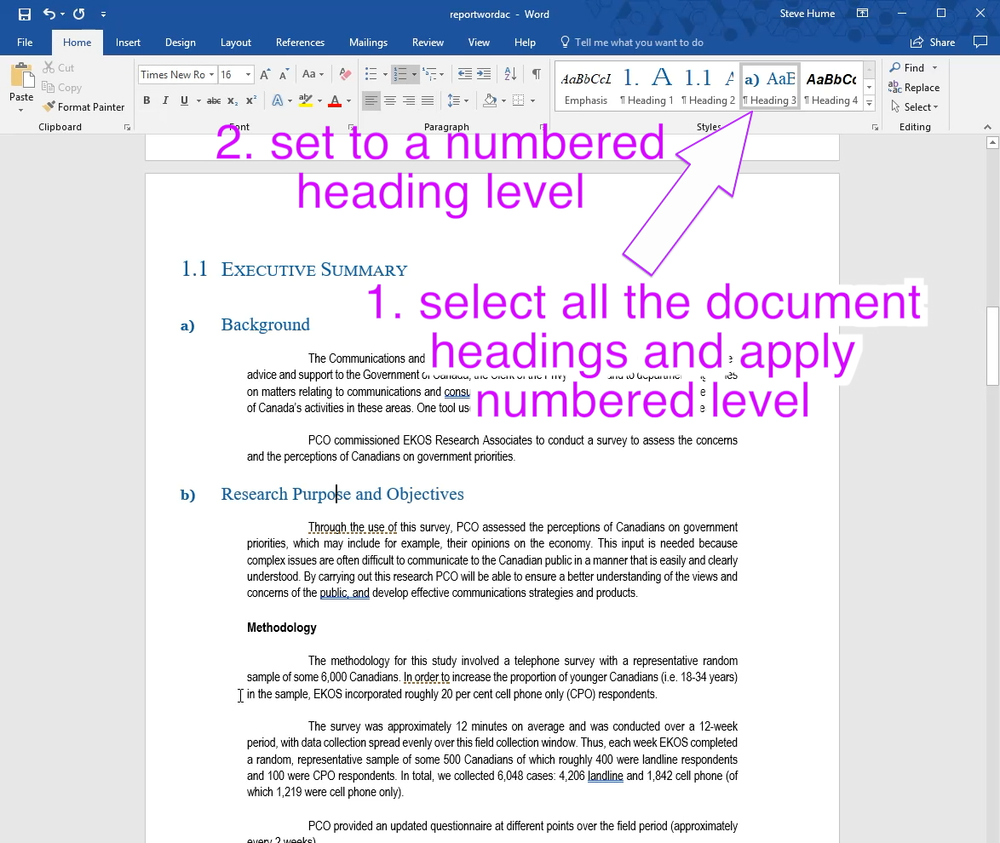

# Prepare for a table of contents after conversion

The conversion tools cannot use the Word table of contents to generate a page table of contents in the HTML.  I found that it will work if the numbered headings styles are used. 

It is easiest to use the Styles tool in word to get the content links transferred to the final result.

The WCAG recommendations need a Title in the HTML and it is best to extract it from the header page at this step.

Here are some typical operations from the sample project file:

- In this file a multi-part title is used and HTML only has a single title. So edit the titles so that they are one long title on a single line and then style it with heading1.  Select the text and save it for later use in the conversion script.

- continue through the document assigning the numbered heading levels.  Also collapse any multi-line titles.

Save the file.  I have used the suffix "ac" added to indicate that it has been through the accessibility checker review and repair steps.