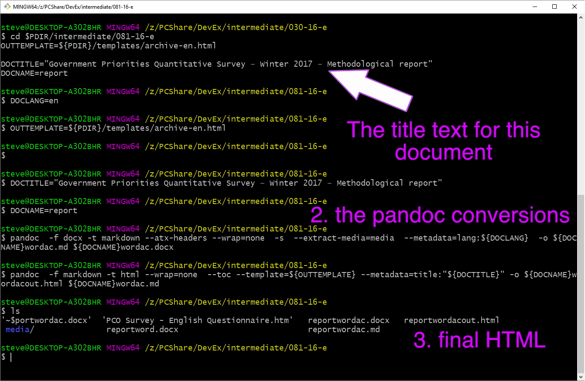

# Technique H: **Convert the Markdown format to HTML5**

Staying in the same terminal session from the previous conversion to Markdown, set some more values.

    OUTTEMPLATE=${PDIR}/templates/archive-${DOCLANG}.html

    DOCTITLE="Government Priorities Quantitative Survey – Winter 2017 – Methodological report"

This resets the OUTTEMPLATE to refer the proper language template. These templates can be enhanced. I left them relatively simple. You need to make sure the templates folder is in PDIR directory.

The DOCTITLE is the title that we saved when adjusting the header levels in Word.  It needs to be assigned to make sure the output HTML has a title in the head section as recommended in WCAG. Now pandoc assembles all the html.

    pandoc  -f markdown -t html --wrap=none  --toc --template=${OUTTEMPLATE} --metadata=title:"${DOCTITLE}" -o ${DOCNAME}wordacout.html ${DOCNAME}wordac.md

This is a terminal session of both conversions and an "ls" of the intermediate folder.

You can examine the HTML source generated in Visual Studio Code and you can open the .html file in a browser to verify that it has all the expected content from the report.

When you move the .html file to a new location as I have done in this repo, you need to move a copy of the media folder with the images. This repo has the results in docs/final so that Github pages will serve up the HTML for you to see when looking at the documentation.