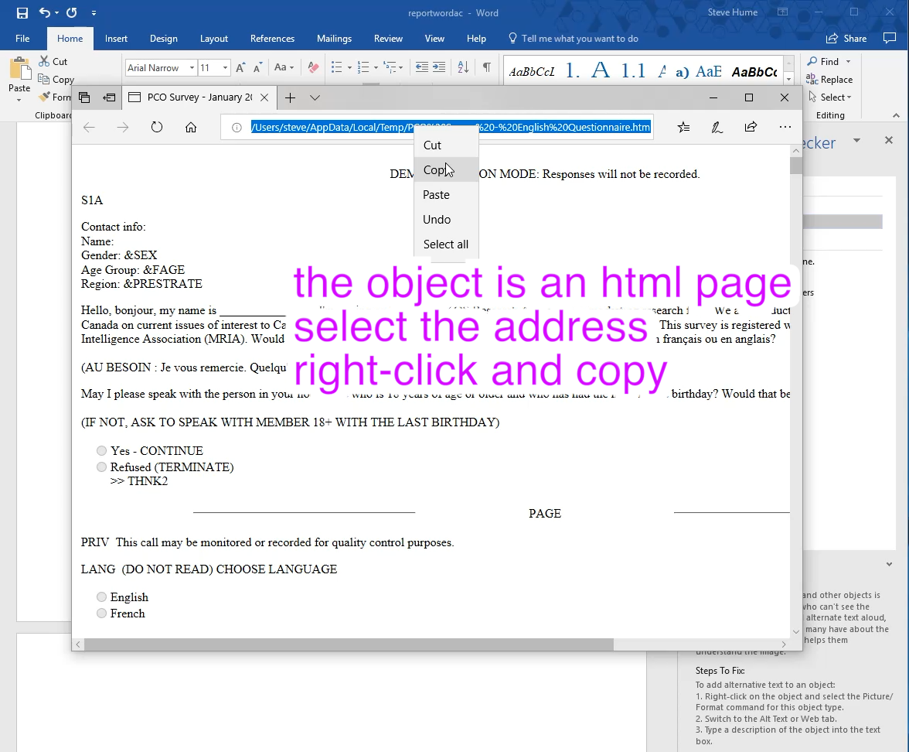

# Dealing with embedded content in Word documents

## Technique K: Icons linking embedded-content

When reviewing items in the Microsoft Word accessibility checker you may encounter items labeled "Object"  that reveal an embedded file.  These occur because the report builders were guided to submit a single file and some of the Appendices are tables based on Excel or complex HTML files that would lose their formatting if directly imported into Word.

## Example of extracting some embedded HTML content

One of the reports in the challenge set is illustrated:

= the Object is encountered in the Accessibility Checker

- Open the file that turns out to be HTML

- the object opens in a browser. We need to save the html source by selecting the address that is in a temporary directory

- open the Bash Terminal application and navigate to the temp folder

      cd ~/AppData/Local/Temp
      ls

- list the files and copy the name of the HTML file

- open the file in Visual Studio Code by using the terminal command

      code 'PCO Survey - English Questionnaire.htm'

- save the source code into the intermediate working folder

