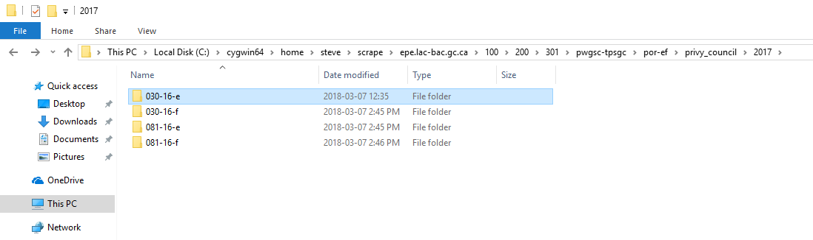
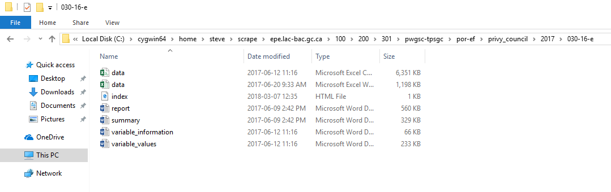

# Fetching the files from the Library and Archives (LAC)

## Get ready

The original thought was that I might be able to automate the conversion of the POR report files, so I spent a few hours figuring out how to fetch the files. LAC has a clever but hackable pop-up challenge page.

The first step is to use the Cygwin Terminal that comes with the wget install.

## Make a directory to store the website copy
 
    mkdir scrape
    cd scrape

## Run the wget mirror command for each report that you wish to work on

    wget --mirror --convert-links --page-requisites --no-parent --no-cookies --header "Cookie: notice; path=/100/200/301;"  http://epe.lac-bac.gc.ca/100/200/301/pwgsc-tpsgc/por-ef/privy_council/2017/030-16-e/index.html

You can consult the wget manual online to get explanations of all the options. The `--header "Cookie: notice; path=/100/200/301;"` part is the magic that supplies the cookie to dodge the popup warning page.

For this challenge there is another report and the French counterparts.

    wget --mirror --convert-links --page-requisites --no-parent --no-cookies --header "Cookie: notice; path=/100/200/301;"  http://epe.lac-bac.gc.ca/100/200/301/pwgsc-tpsgc/por-ef/privy_council/2017/030-16-f/index.html

    wget --mirror --convert-links --page-requisites --no-parent   --no-cookies --header "Cookie: notice; path=/100/200/301;" http://epe.lac-bac.gc.ca/100/200/301/pwgsc-tpsgc/por-ef/privy_council/2017/081-16-e/index.html

    wget --mirror --convert-links  --page-requisites --no-parent --no-cookies --header "Cookie: notice; path=/100/200/301;"   http://epe.lac-bac.gc.ca/100/200/301/pwgsc-tpsgc/por-ef/privy_council/2017/081-16-f/index.html
## Example results
Here is a copy of my terminal window contents:

    steve@DESKTOP-A302BHR ~
    $ pwd
    /home/steve

    steve@DESKTOP-A302BHR ~
    $ mkdir scrape

    steve@DESKTOP-A302BHR ~
    $ ls
    scrape

    steve@DESKTOP-A302BHR ~
    $ SCRAPEDIR=~/scrape

    steve@DESKTOP-A302BHR ~
    $ export SCRAPEDIR

    steve@DESKTOP-A302BHR ~
    $ cd $SCRAPEDIR
    $ wget --mirror --convert-links --page-requisites --no-parent --no-cookies --hea                                                                                  der "Cookie: notice; path=/100/200/301;"  http://epe.lac-bac.gc.ca/100/200/301/p                                                                                  wgsc-tpsgc/por-ef/privy_council/2017/030-16-e/index.html
    --2018-03-07 20:58:23--  http://epe.lac-bac.gc.ca/100/200/301/pwgsc-tpsgc/por-ef                                                                                  /privy_council/2017/030-16-e/index.html
    Resolving epe.lac-bac.gc.ca (epe.lac-bac.gc.ca)... 142.78.40.24
    Connecting to epe.lac-bac.gc.ca (epe.lac-bac.gc.ca)|142.78.40.24|:80... connecte                                                                                  d.
    HTTP request sent, awaiting response... 200 OK
    Length: 882 [text/html]
    Saving to: ‘epe.lac-bac.gc.ca/100/200/301/pwgsc-tpsgc/por-ef/privy_council/2017/                                                                                  030-16-e/index.html’

    epe.lac-bac.gc.ca/1 100%[===================>]     882  --.-KB/s    in 0s

    2018-03-07 20:58:23 (6.99 MB/s) - ‘epe.lac-bac.gc.ca/100/200/301/pwgsc-tpsgc/por                                                                                  -ef/privy_council/2017/030-16-e/index.html’ saved [882/882]

    Loading robots.txt; please ignore errors.
    --2018-03-07 20:58:23--  http://epe.lac-bac.gc.ca/robots.txt
    Reusing existing connection to epe.lac-bac.gc.ca:80.
    HTTP request sent, awaiting response... 302 Found
    Location: http://www.collectionscanada.ca/000/007/000007-404-003008.html [follow                                                                                  ing]
    --2018-03-07 20:58:23--  http://www.collectionscanada.ca/000/007/000007-404-0030                                                                                  08.html
    Resolving www.collectionscanada.ca (www.collectionscanada.ca)... 142.78.200.66
    Connecting to www.collectionscanada.ca (www.collectionscanada.ca)|142.78.200.66|                                                                                  :80... connected.
    HTTP request sent, awaiting response... 200 OK
    Length: 7896 (7.7K) [text/html]
    Saving to: ‘epe.lac-bac.gc.ca/robots.txt’

    epe.lac-bac.gc.ca/r 100%[===================>]   7.71K  --.-KB/s    in 0.008s

    2018-03-07 20:58:23 (1.00 MB/s) - ‘epe.lac-bac.gc.ca/robots.txt’ saved [7896/789                                                                                  6]

    --2018-03-07 20:58:23--  http://epe.lac-bac.gc.ca/www-pages/eppp.css
    Connecting to epe.lac-bac.gc.ca (epe.lac-bac.gc.ca)|142.78.40.24|:80... connecte                                                                                  d.
    HTTP request sent, awaiting response... 302 Found
    Location: http://www.collectionscanada.ca/000/007/000007-404-003008.html [follow                                                                                  ing]
    --2018-03-07 20:58:23--  http://www.collectionscanada.ca/000/007/000007-404-0030                                                                                  08.html
    Connecting to www.collectionscanada.ca (www.collectionscanada.ca)|142.78.200.66|                                                                                  :80... connected.
    HTTP request sent, awaiting response... 200 OK
    Length: 7896 (7.7K) [text/html]
    Saving to: ‘epe.lac-bac.gc.ca/www-pages/eppp.css’

    epe.lac-bac.gc.ca/w 100%[===================>]   7.71K  --.-KB/s    in 0.02s

    Last-modified header missing -- time-stamps turned off.
    2018-03-07 20:58:23 (458 KB/s) - ‘epe.lac-bac.gc.ca/www-pages/eppp.css’ saved [7                                                                                  896/7896]

    --2018-03-07 20:58:23--  http://epe.lac-bac.gc.ca/100/200/301/pwgsc-tpsgc/por-ef                                                                                  /privy_council/2017/030-16-e/report.docx
    Connecting to epe.lac-bac.gc.ca (epe.lac-bac.gc.ca)|142.78.40.24|:80... connecte                                                                                  d.
    HTTP request sent, awaiting response... 200 OK
    Length: 572885 (559K) [text/plain]
    Saving to: ‘epe.lac-bac.gc.ca/100/200/301/pwgsc-tpsgc/por-ef/privy_council/2017/                                                                                  030-16-e/report.docx’

    epe.lac-bac.gc.ca/1 100%[===================>] 559.46K   326KB/s    in 1.7s

    2018-03-07 20:58:25 (326 KB/s) - ‘epe.lac-bac.gc.ca/100/200/301/pwgsc-tpsgc/por-                                                                                  ef/privy_council/2017/030-16-e/report.docx’ saved [572885/572885]

    --2018-03-07 20:58:25--  http://epe.lac-bac.gc.ca/100/200/301/pwgsc-tpsgc/por-ef                                                                                  /privy_council/2017/030-16-e/summary.docx
    Reusing existing connection to epe.lac-bac.gc.ca:80.
    HTTP request sent, awaiting response... 200 OK
    Length: 336080 (328K) [text/plain]
    Saving to: ‘epe.lac-bac.gc.ca/100/200/301/pwgsc-tpsgc/por-ef/privy_council/2017/                                                                                  030-16-e/summary.docx’

    epe.lac-bac.gc.ca/1 100%[===================>] 328.20K  1.75MB/s    in 0.2s

    2018-03-07 20:58:25 (1.75 MB/s) - ‘epe.lac-bac.gc.ca/100/200/301/pwgsc-tpsgc/por                                                                                  -ef/privy_council/2017/030-16-e/summary.docx’ saved [336080/336080]

    --2018-03-07 20:58:25--  http://epe.lac-bac.gc.ca/100/200/301/pwgsc-tpsgc/por-ef                                                                                  /privy_council/2017/030-16-e/data.xlsx
    Reusing existing connection to epe.lac-bac.gc.ca:80.
    HTTP request sent, awaiting response... 200 OK
    Length: 1226525 (1.2M) [text/plain]
    Saving to: ‘epe.lac-bac.gc.ca/100/200/301/pwgsc-tpsgc/por-ef/privy_council/2017/                                                                                  030-16-e/data.xlsx’

    epe.lac-bac.gc.ca/1 100%[===================>]   1.17M  2.95MB/s    in 0.4s

    2018-03-07 20:58:26 (2.95 MB/s) - ‘epe.lac-bac.gc.ca/100/200/301/pwgsc-tpsgc/por                                                                                  -ef/privy_council/2017/030-16-e/data.xlsx’ saved [1226525/1226525]

    --2018-03-07 20:58:26--  http://epe.lac-bac.gc.ca/100/200/301/pwgsc-tpsgc/por-ef                                                                                  /privy_council/2017/030-16-e/data.csv
    Reusing existing connection to epe.lac-bac.gc.ca:80.
    HTTP request sent, awaiting response... 200 OK
    Length: 6502714 (6.2M) [text/plain]
    Saving to: ‘epe.lac-bac.gc.ca/100/200/301/pwgsc-tpsgc/por-ef/privy_council/2017/                                                                                  030-16-e/data.csv’

    epe.lac-bac.gc.ca/1 100%[===================>]   6.20M  3.02MB/s    in 2.1s

    2018-03-07 20:58:28 (3.02 MB/s) - ‘epe.lac-bac.gc.ca/100/200/301/pwgsc-tpsgc/por                                                                                  -ef/privy_council/2017/030-16-e/data.csv’ saved [6502714/6502714]

    --2018-03-07 20:58:28--  http://epe.lac-bac.gc.ca/100/200/301/pwgsc-tpsgc/por-ef                                                                                  /privy_council/2017/030-16-e/variable_information.docx
    Reusing existing connection to epe.lac-bac.gc.ca:80.
    HTTP request sent, awaiting response... 200 OK
    Length: 67135 (66K) [text/plain]
    Saving to: ‘epe.lac-bac.gc.ca/100/200/301/pwgsc-tpsgc/por-ef/privy_council/2017/                                                                                  030-16-e/variable_information.docx’

    epe.lac-bac.gc.ca/1 100%[===================>]  65.56K  --.-KB/s    in 0.02s

    2018-03-07 20:58:28 (3.77 MB/s) - ‘epe.lac-bac.gc.ca/100/200/301/pwgsc-tpsgc/por                                                                                  -ef/privy_council/2017/030-16-e/variable_information.docx’ saved [67135/67135]

    --2018-03-07 20:58:28--  http://epe.lac-bac.gc.ca/100/200/301/pwgsc-tpsgc/por-ef                                                                                  /privy_council/2017/030-16-e/variable_values.docx
    Reusing existing connection to epe.lac-bac.gc.ca:80.
    HTTP request sent, awaiting response... 200 OK
    Length: 238293 (233K) [text/plain]
    Saving to: ‘epe.lac-bac.gc.ca/100/200/301/pwgsc-tpsgc/por-ef/privy_council/2017/                                                                                  030-16-e/variable_values.docx’

    epe.lac-bac.gc.ca/1 100%[===================>] 232.71K  --.-KB/s    in 0.08s

    2018-03-07 20:58:28 (3.00 MB/s) - ‘epe.lac-bac.gc.ca/100/200/301/pwgsc-tpsgc/por                                                                                  -ef/privy_council/2017/030-16-e/variable_values.docx’ saved [238293/238293]

    FINISHED --2018-03-07 20:58:28--
    Total wall clock time: 5.7s
    Downloaded: 9 files, 8.5M in 4.5s (1.91 MB/s)
    Converting links in epe.lac-bac.gc.ca/100/200/301/pwgsc-tpsgc/por-ef/privy_counc                                                                                  il/2017/030-16-e/index.html... 7-0
    Converting links in epe.lac-bac.gc.ca/robots.txt... 2-7
    Converting links in epe.lac-bac.gc.ca/www-pages/eppp.css... 2-7
    Converted links in 3 files in 0.05 seconds.

## Where the files are

This is an image of the report folders:

This is an image of all the files in one report folder to be processed:

