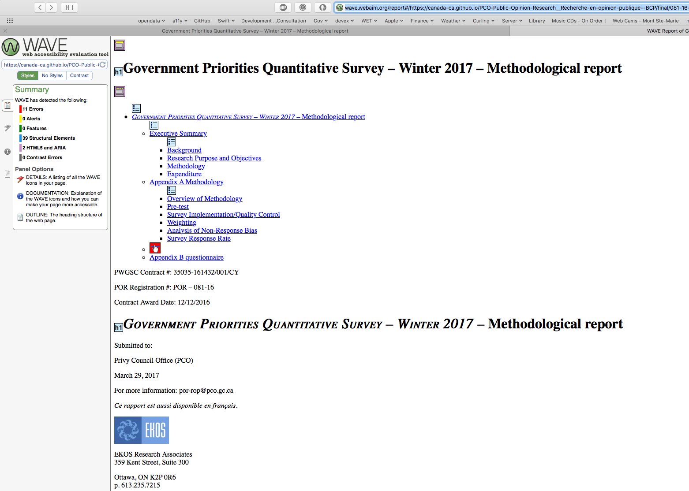
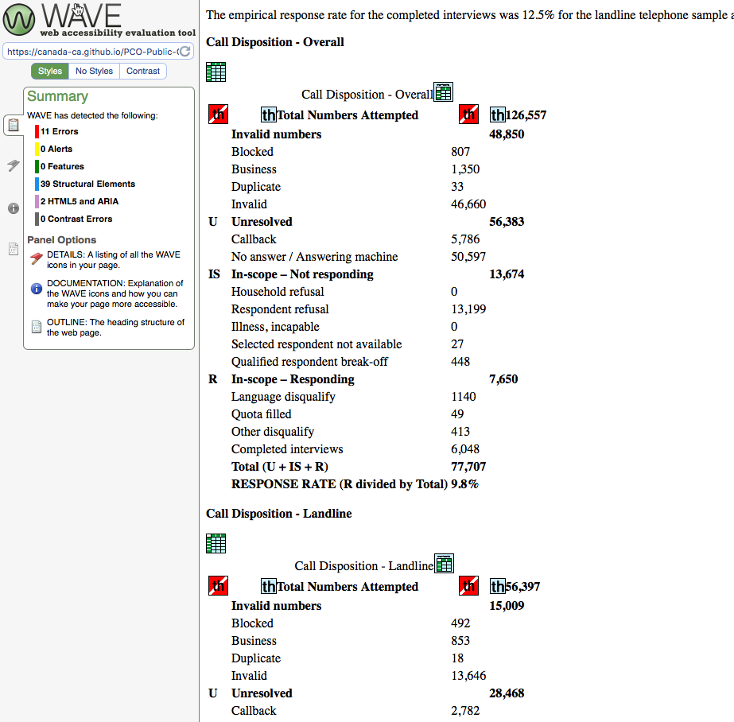

# http://wave.webaim.org  test site

WAVE is one of the online accessibility test tools that you can use to highlight issues.

For our demonstration page you can see the [results](http://wave.webaim.org/report#/https://canada-ca.github.io/PCO-Public-Opinion-Research__Recherche-en-opinion-publique--BCP/final/081-16-e/reportwordacout.html)

You need to have a website to put the result on so that the tool can fetch the page.

The result look like this.

You will notice there are 11 errors in the summary.  These are mostly due to the missing table headers.

