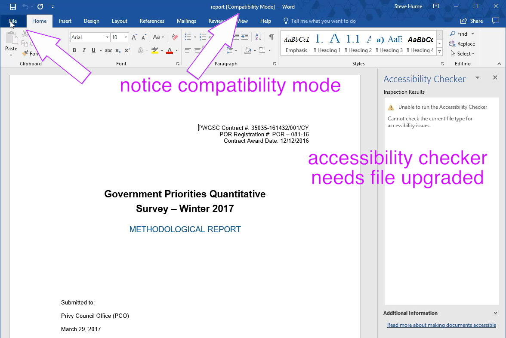
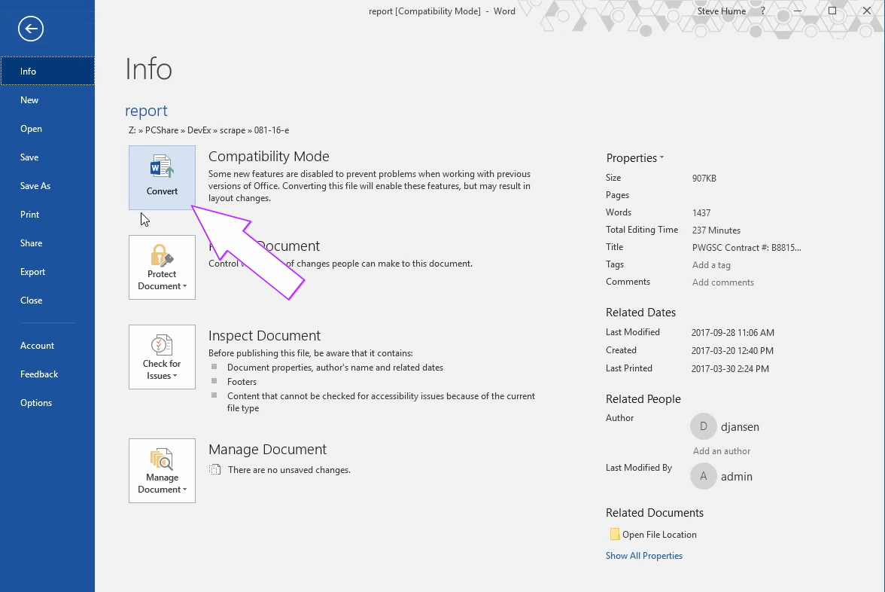
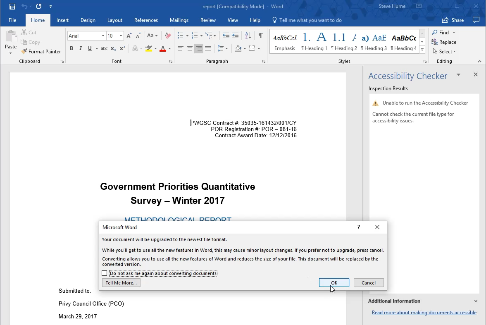
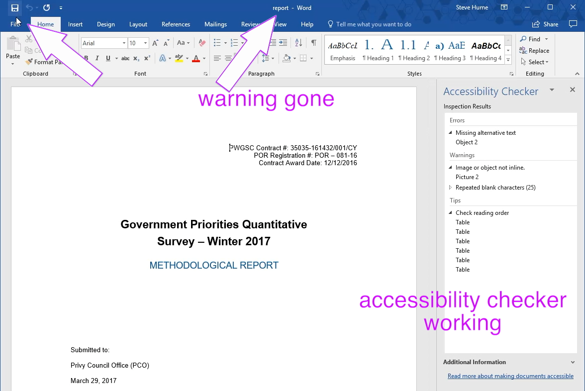
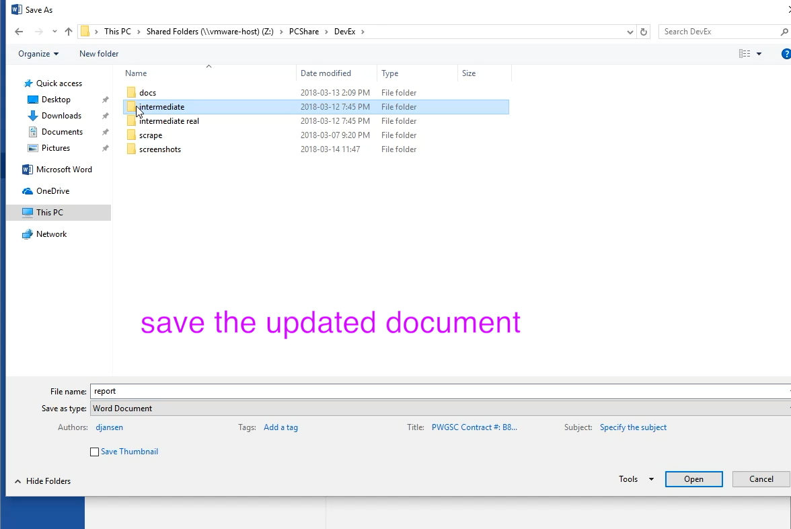
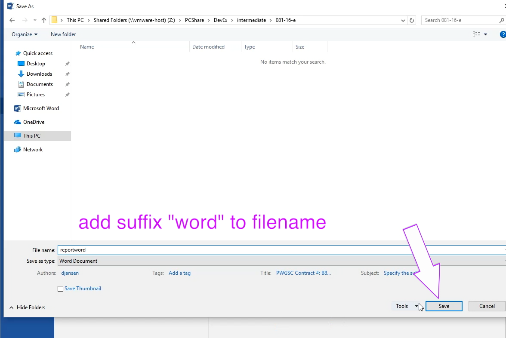
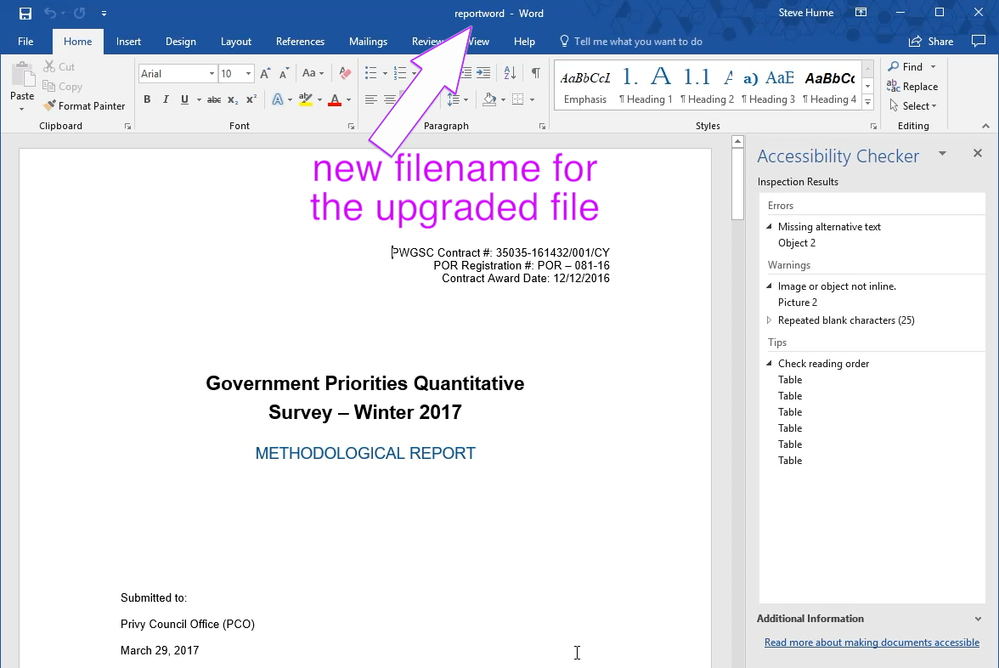

# Accessibility improvements to the Microsoft Word document

It easier to use Word to make much of the improvement to accessibility. There is an accessibility check tool to help to spot some problem areas.

## Step 1 - Technique A: Upgrade

The following images show the steps:
- Open the file

- Upgrade the file using the Compatibility Button

- Save the file to the "intermediate" folder to hold working files

- Add the suffix "word" to the filename to keep it distinct

-  and acknowledge that is finished **Technique A** by the accessibility checker working.

